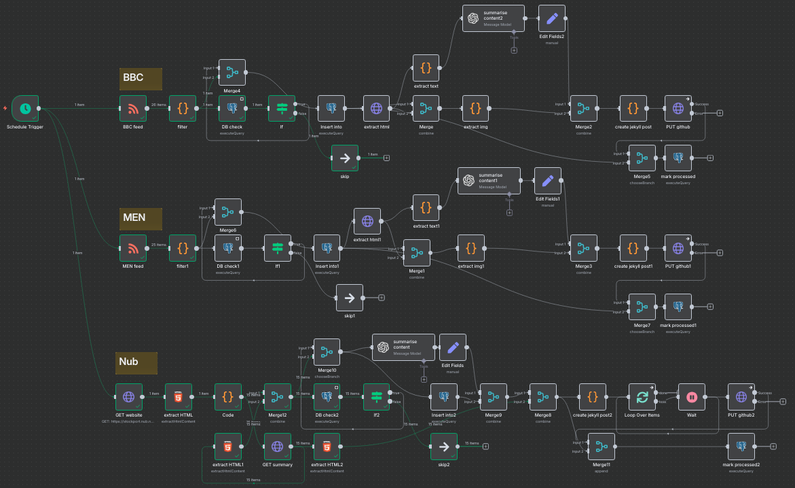

# Viaduct Echo News Aggregation System (Work in progress)

An automated news aggregation and publishing system that monitors local Stockport news sources and automatically publishes summarized articles to a Jekyll blog with comprehensive duplicate detection and database management.

## System Overview

The system operates through two parallel processing pipelines in n8n that monitor BBC Manchester and Manchester Evening News (MEN) RSS feeds for Stockport-related content. All articles are stored in a PostgreSQL database to prevent duplicate processing and enable system scalability.

## Features

- **Automated RSS Monitoring**: Hourly checks of BBC Manchester and MEN news feeds
- **Content Filtering**: Identifies articles containing "Stockport" in titles or content
- **Duplicate Prevention**: PostgreSQL database tracks processed articles by URL hash
- **Database Management**: Neon-hosted PostgreSQL stores article metadata and processing state
- **Image Extraction**: Pulls featured images from original articles using Open Graph meta tags
- **Full Text Extraction**: Parses HTML to extract complete article content
- **AI Summarization**: Uses AI assistant to create concise 200-word summaries
- **Jekyll Integration**: Automatically creates properly formatted blog posts
- **GitHub Publishing**: Commits posts directly to GitHub Pages repository with branch control

## Database Schema

### rss_articles Table
- `id`: Auto-incrementing primary key
- `original_title`: Article headline (VARCHAR 500)
- `original_link`: Source URL (TEXT, UNIQUE)
- `original_summary`: RSS feed summary (TEXT)
- `original_source`: News source identifier (VARCHAR 100)
- `original_pubdate`: Publication timestamp (TIMESTAMPTZ)
- `url_hash`: MD5 hash of URL for fast duplicate detection (VARCHAR 64, UNIQUE)
- `created_at`: Database insertion timestamp (TIMESTAMPTZ)
- `processed`: Boolean flag tracking AI processing completion

## Workflow Components

### Data Sources
- **BBC Manchester RSS**: `https://feeds.bbci.co.uk/news/england/manchester/rss.xml`
- **Manchester Evening News RSS**: `https://www.manchestereveningnews.co.uk/news/greater-manchester-news/?service=rss`

### Processing Pipeline ([n8n](https://n8n.io/))
1. **Schedule Trigger**: Runs every hour to check for new articles
2. **RSS Feed Parsing**: Extracts article metadata (title, link, summary, date)
3. **Content Filtering**: Python script identifies Stockport-related articles
4. **Database Duplicate Check**: Queries PostgreSQL for existing URL hashes
5. **Conditional Processing**: IF node routes new articles to processing pipeline
6. **Database Insert**: Stores new articles with parameterized SQL queries
7. **Data Merging**: Combines database records with RSS metadata for processing
8. **HTML Extraction**: Downloads full article HTML content
9. **Image Extraction**: Parses HTML for Open Graph images
10. **Text Extraction**: Extracts article body content from HTML
11. **AI Summarization**: Creates 200-word summaries via message model
12. **Jekyll Post Creation**: Formats content as Jekyll markdown with YAML front matter
13. **GitHub Commit**: Publishes posts to repository via GitHub API (configurable branch)
14. **Processing State Update**: Marks articles as processed in database

### Output Format

Each article becomes a Jekyll post with:
- **YAML Front Matter**: Title, author, date, categories, image, description
- **AI Summary**: Concise 200-word article summary
- **Source Attribution**: Links back to original article
- **Automatic Metadata**: Publication timestamps and categorization

## Technical Implementation

- **Platform**: n8n workflow automation
- **Database**: PostgreSQL (Neon-hosted) with indexed duplicate detection
- **Runtime**: Hourly scheduled execution with duplicate filtering
- **Content Processing**: Python scripts for filtering and text extraction
- **AI Integration**: Message model for content summarization
- **Publication**: GitHub API for Jekyll site updates with branch control
- **Live Site**: https://viaductecho.info

## Database Operations

### Duplicate Detection
- URL hash generation using MD5 for fast lookups
- Parameterized queries prevent SQL injection
- Unique constraints on URL and hash fields

### Processing State Management
- Boolean flags track AI processing completion
- Prevents redundant expensive operations
- Enables workflow restarts without reprocessing

## Recent Improvements

- ✅ **Comprehensive Duplicate Detection**: Database-backed URL hash system
- ✅ **Processing State Tracking**: Prevents redundant AI summarization
- ✅ **Parameterized SQL Queries**: SQL injection protection
- ✅ **Branch-Specific Publishing**: Test deployment capability
- ✅ **Indexed Database Performance**: Fast duplicate lookups

## Known Limitations

- Dependent on stable HTML structure from news sources
- AI summarization costs accumulate with usage
- Limited error handling for failed extractions
- No content quality validation for AI summaries

## Future Improvements

- Add error handling and fallback mechanisms for processing failures
- Monitor and optimize AI usage costs with usage analytics
- Enhance text extraction robustness across different site structures
- Add content quality validation for AI summaries
- Expand to additional local news sources
- Implement article categorization beyond Stockport filtering
